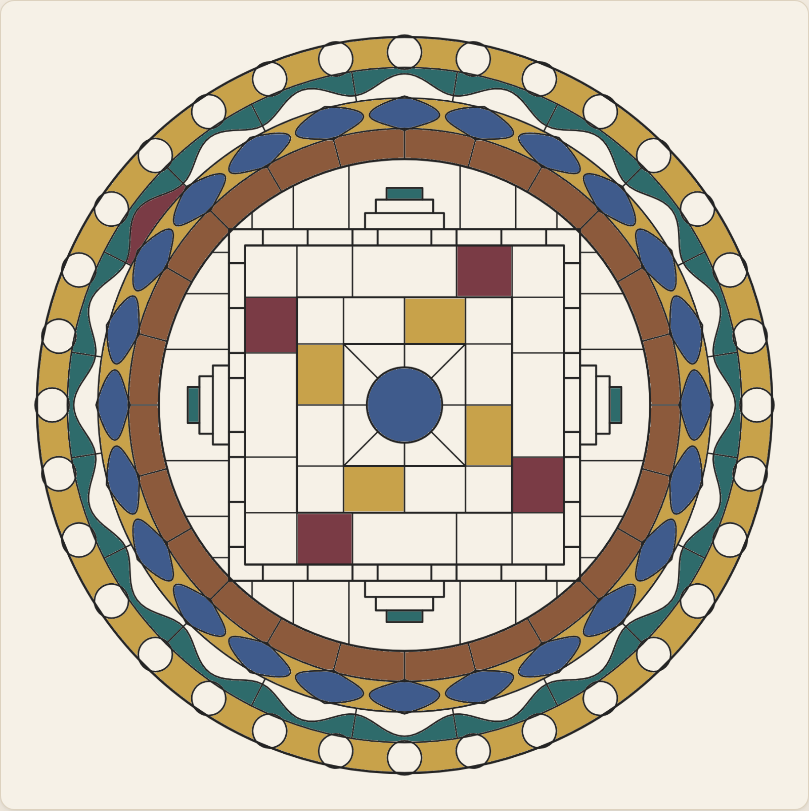
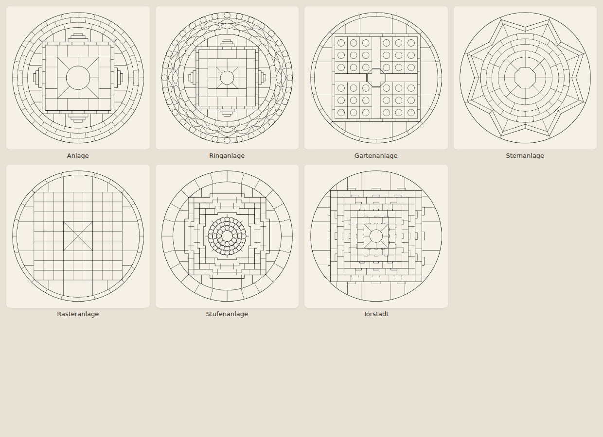
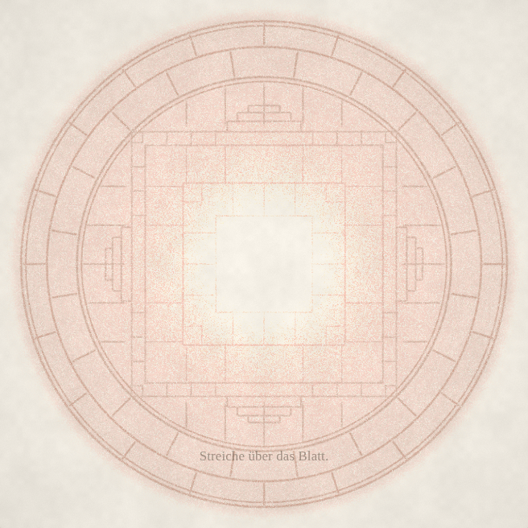
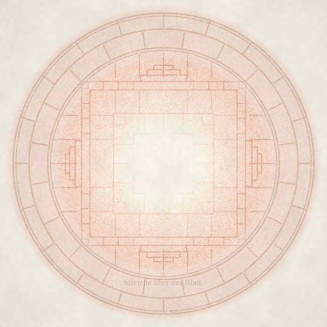

# Anlagen — Stufe 4.0

> **Stand: Prototyp.** Eine Motivwelt „Anlagen“ und eine Vorlage darin
> („Anlage“) stehen im Mandala Atelier und laufen. Dieses Papier hält fest,
> woher die Idee kommt, was daran neu ist, was bewusst *nicht* übernommen
> wurde und was jetzt nur noch Menschen beantworten können, die davor sitzen.

---

## 1. Warum die Zählung 4.0 heißt und trotzdem keine vierte App entsteht

Der Anlass war die Sorge, die App könnte zu groß werden — technisch, nicht
gedanklich. Deshalb wurde gemessen, bevor entschieden wurde.

    5 Canvas-Ebenen, 900 logisch bei dpr 2   61,8 MB Grafikspeicher
    renderMotif()  Median 0,2 ms             Maximum 7,4 ms

Die Kosten der App hängen nicht am Katalog, sondern an der **einen geöffneten
Vorlage**. Motive sind Datensätze mit `build()`; gezeichnet wird nur das
gewählte. Zwanzig weitere Vorlagen kosten zur Laufzeit nichts. Eine vierte App
hätte also ein Problem gelöst, das es nicht gibt — und dafür die Wette
verdoppelt, die seit `atelier-3.md` §14 unentschieden ist.

Was tatsächlich teuer wäre, ist die **Auflösung**. 900 → 1400 logisch hieße
61,8 MB → rund 157 MB allein für die Ebenen, dazu die Schnappschüsse für
Rückgängig. Das ist die Grenze der App, und sie liegt woanders, als man
vermutet.

**4.0 ist deshalb die Stufe, nicht die App.** Die Anlagen wachsen im Mandala
Atelier.

---

## 2. Was an einer Anlage anders ist

Die bisherigen 26 Vorlagen sind **Muster**: Ringe, Blätter, Rauten, Speichen um
eine Mitte. Man ordnet eine Fläche.

Eine Anlage ist ein **Grundriss**. Von außen nach innen:

    Schutzbereich  →  Vorhöfe  →  vier Tore  →  Palastmauer
                   →  Innenhof  →  Kammer  →  Mitte

Das Vorbild ist die tibetische Mandala-Architektur, die genau das ist: ein
Bauwerk, zweidimensional aufgerissen. Übernommen wurde die **Bauordnung**,
nicht das Bildprogramm (siehe §5).

---

## 3. Der Widerspruch, an dem sich alles entschied

Ein Raum lebt davon, dass Orte **verschieden** sind. Der Motor dieser App ist,
dass eine Handbewegung achtundvierzigfach wird — also davon, dass Orte
**gleich** sind. Wer das Osttor gestaltet und dabei die drei anderen Tore
mitgestaltet, hat nichts entdeckt; er hat ein Ornament gemacht, das aussieht
wie ein Grundriss.

Die Auflösung ist der eigentliche Gewinn dieser Stufe:

> **Die Symmetrie hängt nicht mehr an der Einstellung, sondern am Ort.**

| Bereich | Achsen | was die Maschine tut |
|---|---|---|
| Schutzbereich (außen) | 24 | fast alles |
| Palast | 4 | die vier Himmelsrichtungen |
| Mitte | 1 | nichts mehr, auch keine Spiegelung |

Je weiter nach innen, desto weniger wird geschenkt und desto mehr zählt der
einzelne Strich. Damit ist die Architektur keine Dekoration, sondern eine
**Mechanik** — und nebenbei eine erste Antwort auf die offene Frage aus
`atelier-3.md`: *Geschenk oder Diebstahl?* Hier ist es beides, gestaffelt, im
selben Bild. Außen Atelier 2, innen Blatt.

Das Bild oben ist mit **neun Tipps** entstanden und hat **69 Felder**: die
beiden Ringbänder je 24 auf einen Tipp, jedes Feld im Palast vier, die Mitte
genau eines. Man sieht der Fläche an, wo man ist.

Ein Zug gehört dem Bereich, in dem er **aufsetzt**, und behält dessen
Achsenzahl bis zum Loslassen. Sonst änderte sich die Symmetrie mitten im
Strich. Der Testlauf prüft genau diesen Fall.

---

## 4. Die Mitte

Im traditionellen Mandala hat die Mitte eine festgelegte Bedeutung. Hier nicht.

Die Mitte der Anlage ist **das größte einzelne Feld** der ganzen Vorlage und
zugleich der einzige Ort ohne Symmetrie. Sie ist leer. Wer will, gestaltet sie;
wer will, lässt sie, wie sie ist.

Und sie ist **kein Ziel**. Es gibt kein Erreichen des Zentrums, keinen
Abschluss, keine Meldung, wenn man dort ankommt — dieselbe Linie wie im ganzen
übrigen Atelier: keine Gamification. Dass eine Architektur im Kopf des
Betrachters von selbst einen Weg nahelegt, ist gut und gewollt. Die App
bestätigt ihn nur nie.

---

## 5. Was übernommen wurde und was nicht

**Übernommen:** konzentrische Bereiche, starke Symmetrie mit Staffelung, die
vier Himmelsrichtungen, vier Tore, quadratische Architektur im Kreis, Innenhöfe,
Räume in Räumen, Hierarchie, die Bewegung von außen nach innen.

**Nicht übernommen:** buddhistische Gottheiten, Figurenprogramme, Mantras,
tantrische Symbole, festgelegte Bedeutungen. Die Oberfläche nennt die Bereiche
nüchtern und deutsch: Schutzbereich, Vorhof, Tor, Palast, Innenhof, Kammer,
Mitte.

Ausdrücklich **nicht** übernommen wurde auch die Bildsprache der äußeren
Schutzringe. Im Original sind das Flammen- und Leichenacker-Kränze; ihr Aussehen
zu kopieren, führte geradewegs ins Okkult-Esoterische, das diese App nicht will.
Der Schutzbereich ist hier gemauertes Ringwerk, mehr nicht.

> **Offen und vor dem Ausliefern zu klären:** Das README des Ateliers verlangt
> Rücksprache mit der Familie, bevor religiös aufgeladene Zeichen aufgenommen
> werden. Ein Grundriss tibetischer Herkunft ist näher an dieser Grenze als
> alles im bisherigen Katalog, auch ohne ein einziges religiöses Zeichen. Diese
> Rücksprache steht aus.

---

## 6. Zwei Regeln, die beim Bauen sofort zuschnappen

1. **Kein Ringband und kein Mauerband ohne Querwände.** Ein umlaufendes Band
   ist ein einziges, riesiges Feld; ein Tipp färbt den halben Rand. Jedes Band
   bekommt Wände, versetzt gegen das Nachbarband — daraus entsteht nebenbei der
   Mauerverband.

2. **Ein Tor ist kein Loch.** Der Durchgang ist eine Kammer *in* der Mauer,
   geschlossen von beiden Mauerfluchten und den beiden Wangen. Ein wirklich
   offener Durchgang verbände Vorhof und Innenhof zu einem einzigen Raum, und
   ein Tipp färbte den halben Palast. Die Schwelle ist also keine Zierde,
   sondern die Bedingung dafür, dass ein Tor überhaupt eines sein kann — und
   sie kommt hier von der inneren Mauerflucht selbst, die als geschlossenes
   Quadrat umläuft.

   Das Torhaus darüber sitzt auf der äußeren Flucht und nimmt nach außen in
   drei Stufen ab. Eine einzelne Spitze sah, nach außen gedreht, aus wie ein
   Pfeil; eine Stufe, die breiter ist als die darunter, wie ein Stecker. Erst
   die abnehmende Staffelung liest sich als Bauwerk.

Dazu zwei kleinere Festlegungen:

- Eine Anlage bringt ihren **eigenen Rahmen** mit (`frame: false`). Der
  Speichenrahmen `drawWedgeFrame()` liefe ihr quer durch den Palast. Er bleibt
  für alle anderen Motive zwingend.
- Das **Hilfsraster steht still**, sobald eine Anlage geladen ist. Vier Tore in
  vier Richtungen geben dem Blatt zum ersten Mal ein Oben; ein Raster, das sich
  darüber wegdreht, widerspräche dem. Stattdessen zeigt es die Bereiche und in
  jedem so viele Achsen, wie dort wirklich gelten.

---

## 7. Was der Testlauf jetzt zusätzlich prüft

    Gestaffelte Symmetrie (Anlage)
      Schutzbereich    24 von 24 Kopien   0 dazwischen
      Palast            4 von 4 Kopien    0 dazwischen
      Mitte             1 von 1 Kopien    0 dazwischen
      über die Grenze   4 von 4 Kopien    der Zug bleibt beim Aufsetzpunkt
      Schalter aus     12 von 12 Kopien   wie jede andere Vorlage

Die Gegenprobe („0 dazwischen“) ist der eigentliche Test: Es genügt nicht, dass
die erwarteten Kopien da sind — zwischen ihnen darf auch nichts stehen.

Zwei Fehlalarme des alten Testlaufs wurden dabei behoben, beide im Test, nicht
im Motiv:

- Ein Feld, das die **Mitte enthält**, deckt zwangsläufig alle 360° ab. Der
  Winkeltest ist dort blind und wird ausgesetzt.
- Ein Prüfzug **dicht am Mittelpunkt** liegt nach jeder Drehung auf sich selbst.
  Der Zug für die Mitte liegt deshalb weiter außen, aber noch im Bereich.

---

## 8. Was dieses Papier nicht beantworten kann

Ob die Anlage sich beim Ausmalen wirklich wie ein **Raum** anfühlt oder nur wie
ein sehr ordentliches Muster. Das entscheidet niemand am Schreibtisch.

Konkret zu beobachten wäre:

- Fällt die Staffelung überhaupt auf, ohne dass jemand sie erklärt? Der
  Übergang von 24 auf 4 Achsen ist ein starker Sprung — vielleicht zu stark,
  vielleicht genau richtig.
- Geht man nach innen? Bleibt man außen? Kommt man zurück?
- Bleibt die Mitte leer? Und stört das, oder ist es die Erleichterung?
- Sind die Felder groß genug für einen Finger bei 100 %, oder wird die Anlage
  eine Zoom-Vorlage?

---

## 9. Die Ringanlage — was ein Blick auf echte Thangkas ändert

Sieht man sich Kalachakra-Thangkas an, wird schnell klar, was unsere App
**nicht** kann: Figuren, Schrift, Malerei, und eine Dichte, die bei 900
Punkten Kantenlänge um das Fünfzig- bis Hundertfache über unserer liegt. Das
ist eine Grenze, keine Aufgabe — und da wir ohnehin nur die Bauordnung
übernehmen und nicht das Bildprogramm, fallen technische Grenze und
inhaltliche Regel zusammen.

Eines aber lässt sich lernen, ohne eine einzige Figur zu zeichnen: **den
Rhythmus der äußeren Bänder.** Im Original liegen dort fünf, sechs Bänder, und
jedes zählt anders — Lotosblätter, Perlen, Wellen, Flammen, Speichen. Unsere
erste Anlage hat dort zwei, beide dasselbe Mauerwerk, nur versetzt.

Die **Ringanlage** hat vier, jedes mit eigenem Takt:

| Band | Takt | wie es sich teilt |
|---|---|---|
| Perlen | 32 | die Perle greift über beide Randlinien |
| Wellen | 20 | Welle innerhalb, dazu Quermauern |
| Blätter | 24 | das Blatt stößt mit beiden Spitzen durch |
| Speichen | 24 | Quermauern |

Und daraus folgt eine Erweiterung der Staffelung: **Jedes Band bekommt seine
eigene Zone.** Ein Tipp im Perlband färbt 32 Felder, einer im Wellenband 20,
im Palast 4, in der Mitte eines. Die Achsenzahl folgt nicht mehr nur dem Ort,
sondern dem Rhythmus des Bandes, in dem die Hand steht.

Drei Fallen, alle beim ersten Anlauf zugeschnappt:

1. **Fünf schmale Bänder verweben sich.** Jedes Ornament muss ein Stück über
   seine Randlinien hinausreichen, um sich zu schließen; bei 26 Punkt
   Bandbreite ragt es so weit ins Nachbarband, dass ein Geflecht entsteht.
   Breite schlägt Anzahl.
2. **Welle und Blattkranz sprechen dieselbe Sprache.** Eine Welle, die ihre
   Randlinien durchstößt, erzeugt Linsenformen — und Linsen macht auch ein
   Blattkranz. Die Welle bleibt deshalb innerhalb ihres Bandes.
3. **Eine Mauerecke muss den Ring durchstoßen, nicht ihn berühren.** Genau auf
   dem Ring hängen die vier Vorhöfe an den Ecken zusammen und sind ein Feld,
   das einmal rundherum läuft. Der Testlauf meldete es als „360° breit“.

---

## 10. Sieben Anlagen, sieben Grammatiken

Die weiteren fünf sind bewusst keine Abwandlungen derselben Ordnung. Jede folgt
einer anderen Familie aus der Schautafel ([`motive.html`](motive.html)):

| Vorlage | Vorbild | was daran anders ist |
|---|---|---|
| Gartenanlage | Chahar Bagh | ein Kreuz aus Wasserläufen statt Ringen; 36 Beete |
| Sternanlage | Palmanova | Zacken statt Kreis; acht Bastionen, eine Piazza |
| Rasteranlage | Vastu Purusha | 9 × 9 Felder, gar kein Kranz |
| Stufenanlage | Borobudur | außen eckig, innen rund — bei uns sonst umgekehrt |
| Torstadt | Srirangam | zwölf Tore, und sie werden nach innen **kleiner** |

Zwei Fallen kamen dabei neu dazu, beide vom Testlauf gefunden:

- **Ein Sternwall ist keine geschlossene Außengrenze.** Zwischen den
  Bastionsspitzen fällt er auf die Kurtinen zurück, und was dort außen liegt,
  läuft bis in die Ecken des Blattes. Es braucht den Ring bei `R_OUT` *und*
  kurze Binder von den Spitzen dorthin.
- **Binder, die an einem Achteck enden, treffen es nicht.** Dessen Kantenmitte
  liegt um `cos(22,5°)` näher an der Mitte als die Ecke. Enden sie am
  Eckradius, bleibt rundum ein Spalt von fünf Punkten — und das ganze Band ist
  ein Feld.

---

## 11. Dieselbe Idee in „Blatt“ — und warum sie dort anders heißt

Blatt hat die Anlage inzwischen auch, als fünften Charakter in der Blattlade.
Es ist aber **keine Übertragung**, sondern eine zweite Fassung derselben Idee:
Blatt kennt weder Ausmalen noch Motivkatalog noch Symmetrie, die etwas
vervielfältigt. Man reibt ein verborgenes Relief hervor.

Damit fällt der Träger der Idee weg — es gibt keine Symmetrie, die man staffeln
könnte. Die Übersetzung geht über das, was Blatt stattdessen hat: die **Höhe des
Reliefs**.

> Im Atelier nimmt die **Maschine** nach innen immer weniger ab.
> In Blatt gibt das **Papier** nach innen immer weniger her.

Beide Male wird das Innere mehr und mehr die eigene Arbeit — und beide Male ist
die Architektur dadurch eine Mechanik und nicht eine Zeichnung. Gemessen, auf
dem Grat jedes Bauteils, nach zwei leichten Zügen: Schutzbereich 0,60 · Vorhof
0,51 · Mauer 0,43 · Innenhof 0,35 · Kammer 0,28 · Mitte 0,24, gegen 0,12 auf
blanker Fläche.

| nach leichten Zügen über das ganze Blatt | danach nur innen, weiter leicht, aber oft |
|---|---|
|  |  |

Links kommt der Schutzbereich fast von selbst, der Palast bleibt eine Ahnung.
Rechts ist der Palast da — und die Mitte immer noch der ruhigste Ort.

Drei Dinge, die beim Bauen in Blatt anders lagen:

- **n = 4 ist dort Bedingung, nicht Wahl.** Die Rasterung setzt exakte
  Drehsymmetrie um 2π/n voraus; ein Quadrat ist vierzählig. Die Ornamente im
  Schutzbereich dürfen 16-, 20-, 24-zählig sein — Vielfache von vier.
- **Der Grundriss wird bemessen, nicht gewürfelt.** Die vier anderen Charaktere
  biegen den Generator, die Anlage ersetzt ihn. Gewürfelt werden die Maße.
- **Geduld, nicht Kraft.** Wer die Mitte mit fester Hand holen will, bekommt
  sie nicht: Fest greift bis in die Mulden, die Fläche füllt sich, und die
  Architektur ersäuft. Das ist Blatts Bauart, keine Eigenheit der Anlage — aber
  hier fällt es zum ersten Mal auf, weil es etwas zu ertränken gibt.

Damit steht dieselbe Frage jetzt zweimal im Raum, in zwei entgegengesetzten
Wetten. Das ist kein Zufall, sondern genau das Vergleichsprotokoll aus
[`atelier-3.md`](atelier-3.md) §14 — nur diesmal an einem Gegenstand, den beide
Apps teilen.

---

## 12. Was offen ist

- **Aussehen der Tore.** Sie sind derzeit sehr technisch geraten; nach außen
  gesehen liest sich das Dach eher als Pfeil denn als Tor.
- **Sieben Vorlagen im Atelier.** Was fehlt, ist eher das Gegenteil von mehr:
  eine mit wenigen, dafür großen Feldern. Alle sieben sind fein geraten.
  Naheliegend wären eine schlichtere Anlage mit nur zwei Bereichen und eine mit
  einem stärker gegliederten Innenhof.
- **Detail beim Näherkommen.** Reizvoll wäre, dass der Zoom nicht nur
  vergrößert, sondern aufdeckt. Das kostet Auflösung (§1) und ist deshalb Kür,
  nicht Voraussetzung. Architektur will große, unterscheidbare Flächen, kein
  Mikrodetail.
- **Die Rücksprache aus §5.**
- **Test am echten iPad**, wie beim ganzen übrigen Atelier.
